# Setting up environemnt
I am most familiar with JavaScript so I created an environment with a JavaScript
runtime to run my code for this assignment
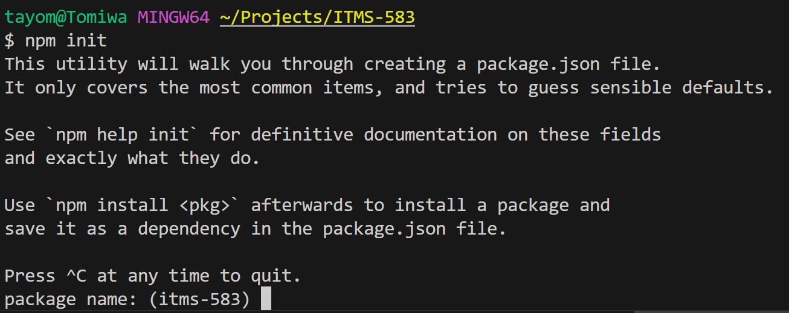

I created a function called index.js to handle the data logic
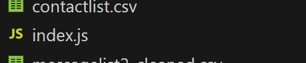

I then created a function in charge of loaded csv files for data manipulation
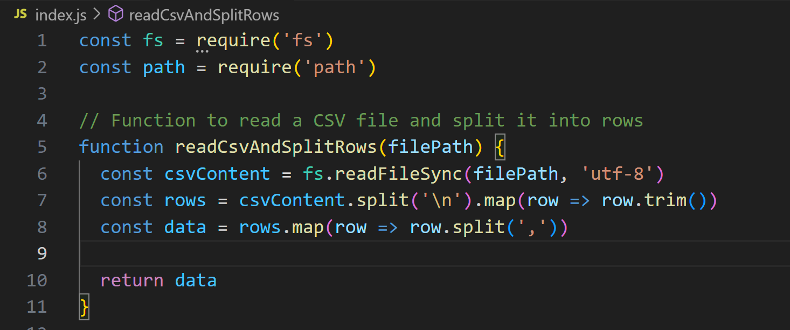
Note: I could have used a serializer or loaded it asynchronously for it to be
more efficient but that was not the focus of the

# Cleaning the data
## Removing non numeric value from phone number
After loading the messagelist2.csv
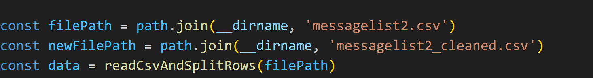

I replaced every non digit character in the Phone Number column with an empty
space using regex
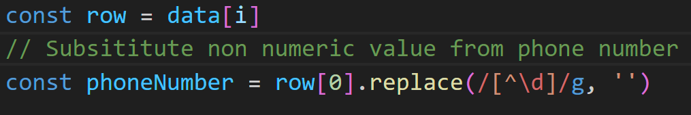

## Escape commas from csv files
I then wrapped every text from column 3 to the column right before the end in a string
`""`
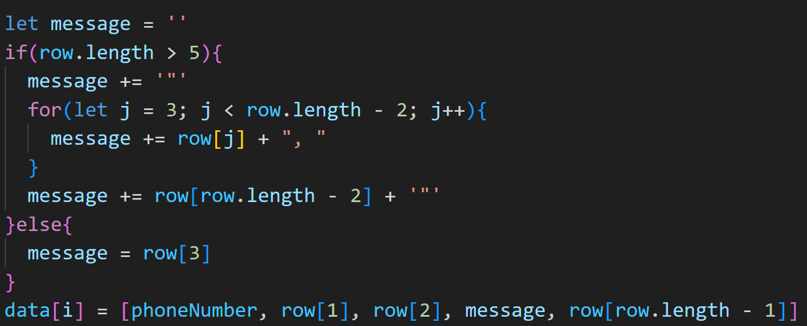
It felt like the most sane way of fixing the problems of the commas, by wrapping
them in string(`""`) I escaped the commas and since I knew the other columns
weren't problems I was pretty confident everything within that range fell into
row 3

I did notice something really weird
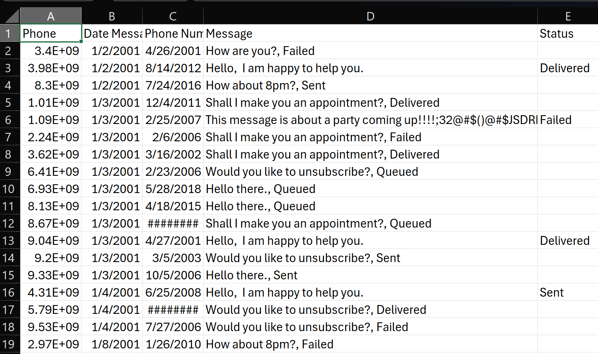
Some status stayed behind on the message column

It turns out some rows ended with commas, and since I used a comma as my
delimiter to decide where to split the columns, that led to some rows having an
extra column that was empty
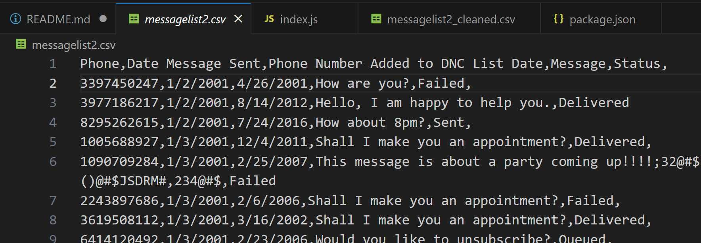

It was an easy fix, I just removed the empty column from the data
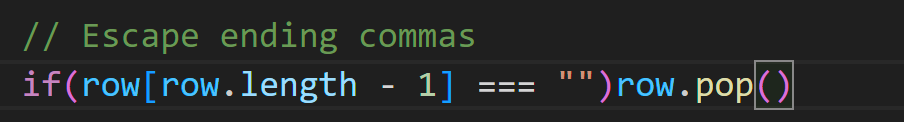
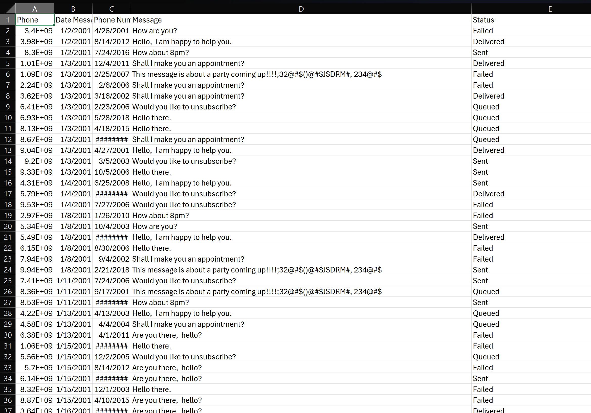

# Creating Artifacts
## alltextsforclassdef.csv
I created a new javascript file called submission.js to handle the creation of
the artifacts
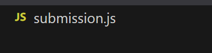

I imported the function to load the csv file that I created earlier along with
some dependencies to handle loading and writing files
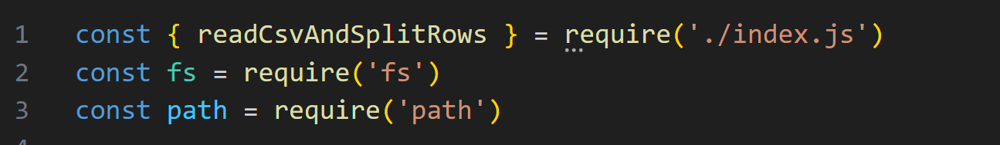

I then loaded the data from messagelist2.csv and contactlist.csv and tossed it
to an array
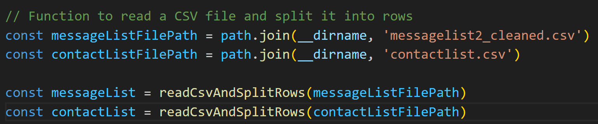

I stored the contactlist rows in a map with the phone number as the key for
easier lookup later on
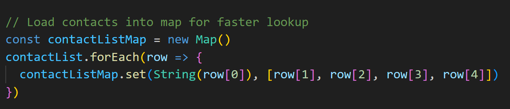

I created a filter function to handle filtering the messagelist data based on
the criteria given in the assignment
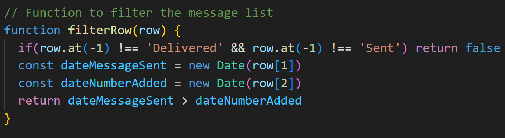

Finally I filtered the data and dumped it to a new variables
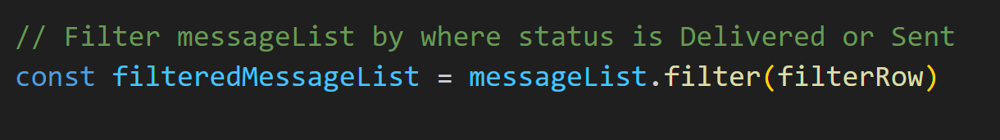

Once the data was filtered, I went through the phone numbers and checked if
there was a match with the previously created map, if there was a match I added the
contact info to the message and pushed it to a new array
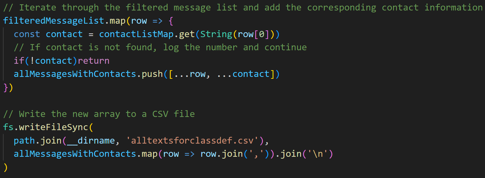

## uniqueclassmembers.csv
Initially I was going to dedupe after getting alltextsforclassdef.csv but I
realized I could just add the logic in the filteredMessageList map and get both
artifacts by the end of the loop, so I did that
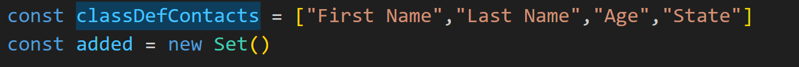
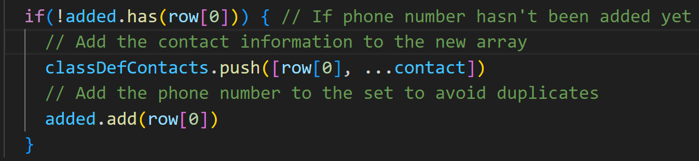

Finally I saved both data into the their respective csv files using the names
given in the assignment
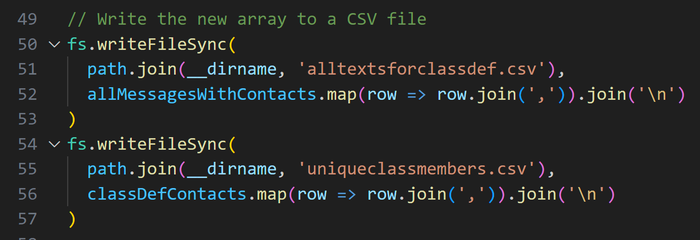
